= CNApy - A CellNetAnalyzer GUI in Python

image::cnapy/data/cnapylogo.svg[cnapy logo]

== Install CNApy with conda

. Create a conda environment with all dependencies

   conda create -n cnapy-0.1.0 -c conda-forge -c bioconda -c arb-lab/label/test cnapy

. On windows install remaining dependencies vi pip:

   pip install cameo==0.11.15 cobra==0.18.1 qtconsole==4.7.7

== Setup the CNApy development environment with conda

We use conda as package manager to install all dependencies. You can use https://docs.conda.io/en/latest/miniconda.html[miniconda].
If you have conda installed you can:

.. on linux

  conda env create -n cnapy -f environment.yml

.. on windows

  conda env create  -n cnapy -f winvironment.yml

. Activate the cnapy conda environment

  conda activate cnapy

. Download cnapy

.. either use `git`
      
  git clone https://github.com/ARB-Lab/CNApy.git

.. or click on the big green button above, download and unpack zip archive. The folder is then `CNApy-master` not `CNApy`.

. Change into the source directory and install CNApy
  
  cd CNApy
  python setup.py install

. Run cnapy
      
  cnapy

IMPORTANT: To use the CNA MATLAB functions you need atleast MATLAB 2019b and the Python API for the MATLAB engine installed and of course CNA

== Install Python API for MATLAB engine in MATLAB 2019b

First activate the cnapy conda environment:

  conda activate cnapy

Findout your `matlabroot`:
----
matlab -batch matlabroot
----

then on Mac and Linux:
----
cd matlabroot/extern/engines/python
python setup.py build --build-base=$(mktemp -d) install
----
Windows Powershell:
----
cd matlabroot/extern/engines/python
python setup.py build --build-base=$env:temp install
----

== Set CNA path

To use the CNA MATLAB functions you need to tell CNApy where CNA is installed.
Therefore, use the configuration dialog under help to change the path to your CNA path.

== How to run a script in the cnapy terminal

----
import testscript
testscript.work(cna)
----

== Create a conda package

----
conda-build . -c conda-forge -c bioconda
anaconda login
anaconda upload -u arb-lab -l test FILENAME
----

== create an installer with constructor

----
constructor .
----