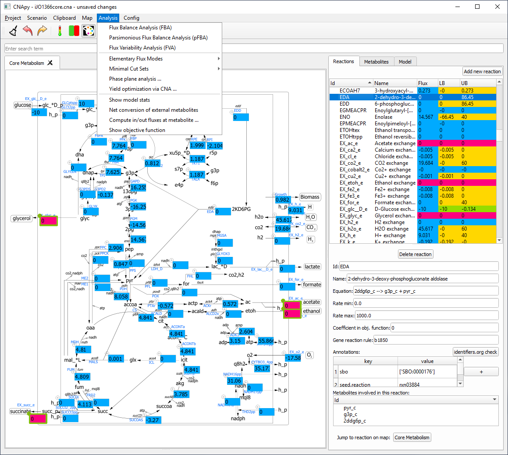

# CNApy: An integrated environment for metabolic modeling

[](https://github.com/cnapy-org/CNApy/releases/latest)
[](https://github.com/cnapy-org/CNApy/commits/master)
[](https://github.com/cnapy-org/CNApy/issues)
[](https://gitter.im/cnapy-org/community)



## Introduction

CNApy [[Paper]](https://doi.org/10.1093/bioinformatics/btab828) is a Python-based graphical user interface for a) many common methods of Constraint-Based Reconstruction and Analysis (COBRA) with stoichiometric metabolic models, b) the visualization of COBRA calculation results as *interactive and editable* metabolic maps (including Escher maps [[GitHub]](https://escher.github.io/#/)[[Paper]](<https://doi.org/10.1371/journal.pcbi.1004321>)) and c) the creation and editing of metabolic models, including its reactions, metabolites and genes. For model loading and export, CNApy supports the widely used SBML standard format [[Site]](https://sbml.org/)[[Paper]](https://www.embopress.org/doi/abs/10.15252/msb.20199110).

Supported COBRA methods (partly provided by cobrapy [[GitHub]](https://github.com/opencobra/cobrapy)[[Paper]](https://doi.org/10.1186/1752-0509-7-74)) include:

- Flux Balance Analysis (FBA) [[Review]](https://doi.org/10.1038/nbt.1614)
- Flux Variability Analysis (FVA) [[Paper]](https://doi.org/10.1016/j.ymben.2003.09.002)
- Yield optimization (based on linear-fractional programming) [[Paper]](https://doi.org/10.1016/j.ymben.2018.02.001)
- Phase plane analyses (can include flux and/or yield optimizations)
- Making measured *in vivo* flux scenarios stoichiometrically feasible, optionally also by altering a biomass reaction [[Paper]](https://academic.oup.com/bioinformatics/article/39/10/btad600/7284109)
- Elementary Flux Modes (EFM) [[Review]](https://analyticalsciencejournals.onlinelibrary.wiley.com/doi/full/10.1002/biot.201200269)
- Thermodynamic methods based on OptMDFpathway [[Paper]](https://doi.org/10.1371/journal.pcbi.1006492)
- Many advanced strain design algorithms such as OptKnock [[Paper]](https://doi.org/10.1002/bit.10803), RobustKnock [[Paper]](https://doi.org/10.1093/bioinformatics/btp704), OptCouple [[Paper]](https://doi.org/10.1016/j.mec.2019.e00087) and advanced Minimal Cut Sets [[Paper]](https://doi.org/10.1371/journal.pcbi.1008110) through its StrainDesign [[GitHub]](https://github.com/klamt-lab/straindesign)[[Paper]](https://doi.org/10.1093/bioinformatics/btac632) integration

**→ For information about how to install CNApy, see section [Installation Options](#installation-options)**

**→ For more details on CNApy's many features, see section [Documentation and Tutorials](#documentation-and-tutorials)**

**→ If you have questions, suggestions or bug reports regarding CNApy, you can use either of the [CNApy GitHub issues](https://github.com/cnapy-org/CNApy/issues), the [CNApy GitHub discussions](https://github.com/cnapy-org/CNApy/discussions) or the [CNApy Gitter chat room](https://gitter.im/cnapy-org/community)**

**→ If you want to cite CNApy, see section [How to cite CNApy](#how-to-cite-cnapy)**

**→ For information about how to contribute to CNApy as a developer, see section [Contribute to the CNApy development](#contribute-to-the-cnapy-development)**

*Associated project note*: If you want to use the well-known MATLAB-based *CellNetAnalyzer* (CNA), *which is not compatible with CNApy*, you can download it from [CNA's website](https://www2.mpi-magdeburg.mpg.de/projects/cna/cna.html).

## Installation Options

There are 4 alternative ways to install CNApy:

1. The easiest way for any user to install CNApy is by downloading its installer, which is provided for Windows, Linux and MacOS, see [Using CNApy installer](#using-cnapy-installer) for more.
2. If you already have installed Python 3.10 (no other version) on your system, you can install CNApy simply through ```pip install cnapy``` in your console. Afterwards, you can start CNApy's GUI by running either ```cnapy``` or, if this doesn't work, ```python -m cnapy``` where "python" must call your Python 3.10 installation.
3. If you already use conda or mamba (for mamba, just change the "conda" command to "mamba"), you can create a CNApy environment named ```cnapy-1.2.4``` as follows: 1) Run ```conda create --name cnapy-1.2.4 python=3.10 pip openjdk -c conda-forge```, 2) run ```conda activate cnapy-1.2.4```, 3) run ```pip install cnapy```. Then, you can start CNApy in the cnapy-1.2.4 conda environment by running either ```cnapy``` or, if this doesn't work, ```python -m cnapy```. Note that the [cnapy conda package](https://anaconda.org/cnapy/cnapy) is currently *not* being updated due to licensing uncertainties.
4. If you want to develop CNApy, follow the instruction for the cloning and setup of the CNApy repository using git and conda or mamba in section [Setup the CNApy development environment](#setup-the-cnapy-development-environment).

## Documentation and Tutorials

- The [CNApy guide](https://cnapy-org.github.io/CNApy-guide/) contains information for all major functions of CNApy.
- Our [CNApy YouTube channel](https://www.youtube.com/channel/UCRIXSdzs5WnBE3_uukuNMlg) provides some videos of working with CNApy.
- We also provide directly usable [CNApy example projects](https://github.com/cnapy-org/CNApy-projects/releases/latest) which include some of the most common *E. coli* models. These projects can also be downloaded within CNApy at its first start-up or via CNApy's File menu.


## Using CNApy installer

This installer lets you create a local installation of CNApy under Windows, Linux or MacOS by following these instructions:

*If you use Windows:*

- Download the Windows installer [from here](https://github.com/cnapy-org/CNApy/releases/download/v1.2.4/install_cnapy_here.bat)
- Put this file into a folder where you want CNApy to be installed.
- Double click on the file and let the CNApy installation run
- Afterwards, you can run CNApy by either double-clicking on the newly created CNApy desktop icon, or by double-clicking "RUN_CNApy.bat" in the newly created cnapy-1.2.4 subfolder.

*If you use Linux or MacOS*:

- Download the Linux & MacOS installer [from here](https://github.com/cnapy-org/CNApy/releases/download/v1.2.4/install_cnapy_here.sh).
- Put this file into a folder where you want CNApy to be installed.
- Make the script executable by opening your console in the folder and run ```chmod u+x ./install_cnapy_here.sh```. Alternatively, if supported on your system, right-click on the file, go the file's settings and mark it as executable.
- Now, either run ```./install_cnapy_here.sh``` in your console or, if supported on your system, double-click on install_cnapy_here.sh.
- Finally, you can run CNApy by calling ```./run_cnapy.sh``` in your console (for this without another path beforehand, your console must point to the folder where run_cnapy.sh is located, e.g. if you are in the folder where install_cnapy_here.sh is located, through ```cd cnapy-1.2.4```). Alternatively, if supported by your system, double-click on "run_cnapy.sh" in the newly created cnapy-1.2.4 subfolder.

Technical side note: CNApy's installer is utilizing [micromamba](https://mamba.readthedocs.io/en/latest/installation/micromamba-installation.html).

## Setup the CNApy development environment

*Note:* The following instructions only have to be followed if you want to contribute to CNApy as a programmer. If this is not the case, follow other steps of the [Installation Options](#installation-options).

Everyone is welcome to contribute to CNApy's development. [See our contribution file for general instructions](https://github.com/cnapy-org/CNApy/blob/master/CONTRIBUTING.md). Any contribution intentionally submitted for inclusion in the work by you, shall be licensed under the terms of the Apache 2.0 license without any additional terms or conditions.

Programatically, we recommend to use uv [[GitHub]](https://github.com/astral-sh/uv) to install all dependencies and manage installed Python versions. Alternatively, one can also use conda/mamba for the same tasks, although you would have to install CNApy's dependencies manually.

### uv usage
You can use uv for CNApy as follows:

1. Make sure that you have installed uv (*Note*: uv can be installed under any Python version as uv will manage the needed Python version later):

```sh
pip install uv
```

2. Checkout the latest cnapy development version using git

```sh
git clone https://github.com/cnapy-org/CNApy.git
```

3. Change into the source directory and run CNApy

```sh
cd CNApy
uv run cnapy.py
```

uv will automatically install the correct Python version (by reading ./.python-version) and CNApy dependencies (by reading ./pyproject.toml). If you get a Java/JDK/JVM/jpype error when running CNApy, consider installing OpenJDK [[Site]](https://openjdk.org/install/) on your system to fix this problem.

## How to cite CNApy

If you use CNApy in your scientific work, please cite CNApy's publication:

Thiele et al. (2022). CNApy: a CellNetAnalyzer GUI in Python for analyzing and designing metabolic networks.
*Bioinformatics* 38, 1467-1469, [doi.org/10.1093/bioinformatics/btab828](https://doi.org/10.1093/bioinformatics/btab828).
