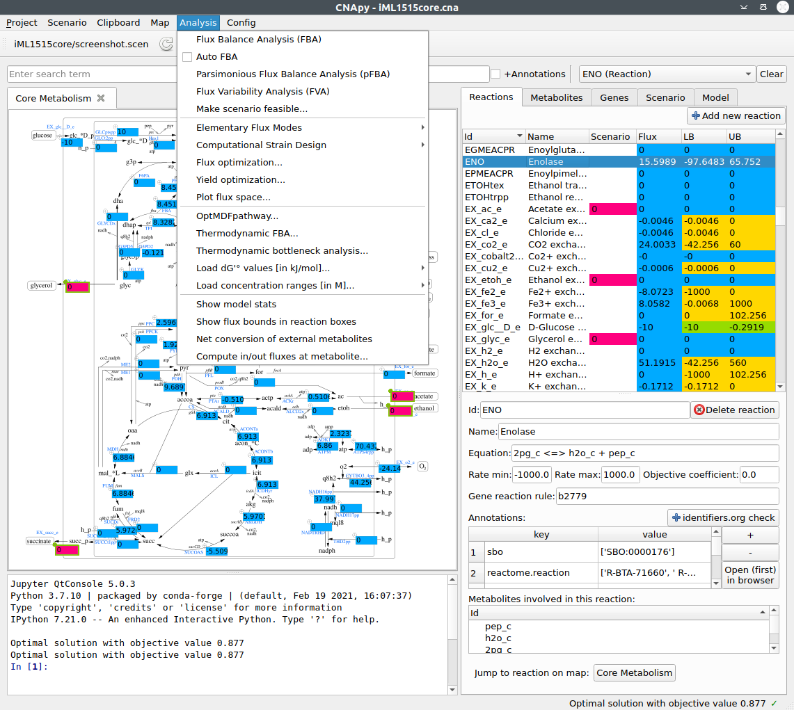

# CNApy: An integrated environment for metabolic modeling

[](https://github.com/cnapy-org/CNApy/releases/latest)
[](https://github.com/cnapy-org/CNApy/commits/master)
[](https://github.com/cnapy-org/CNApy/issues)
[](https://gitter.im/cnapy-org/community)



## Introduction

**If you have questions, suggestions or bug reports regarding CNApy, you can use either of the [CNApy GitHub issues](https://github.com/cnapy-org/CNApy/issues), the [CNApy GitHub discussions](https://github.com/cnapy-org/CNApy/discussions) or the [CNApy Gitter chat room](https://gitter.im/cnapy-org/community).**

CNApy is a Python-based graphical user interface for a) many common methods of Constraint-Based Reconstruction and Analysis (COBRA) with stoichiometric metabolic models, b) the visualization of COBRA calculation results and c) the creation and editing of metabolic models.

Supported COBRA methods (partly provided by [cobrapy](https://opencobra.github.io/cobrapy/)) include:

- Flux Balance Analysis (FBA)
- Flux Variability Analysis (FVA)
- Making measured flux scenarios stoichiometrically feasible
- Elementary Flux Modes (EFM)
- Thermodynamic methods based on [OptMDFpathway](https://doi.org/10.1371/journal.pcbi.1006492)
- Many advanced strain design algorithms such as [OptKnock](https://doi.org/10.1002/bit.10803), [RobustKnock](https://doi.org/10.1093/bioinformatics/btp704), [OptCouple](https://doi.org/10.1016/j.mec.2019.e00087) and [advanced Minimal Cut Sets](https://doi.org/10.1371/journal.pcbi.1008110) through its integration of the [StrainDesign](https://github.com/klamt-lab/straindesign) package
- Yield optimization (based on linear-fractional programming)
- Phase plane analysis

All calculation results can be visualized in CNApy's interactive and editable metabolic maps. These maps can also use vector-based (SVG) backgrounds. [Escher maps](https://escher.github.io/#/) are also natively supported and can be created and edited inside CNApy.

Aside of performing calculations on metabolic models, CNApy can also be used to create and/or edit metabolic models. This includes all important aspects of the model's reactions, metabolites and genes. For model loading and export, CNApy supports the widely used [SBML standard format](https://sbml.org/).

**For more details on CNApy's many more features, see section [Documentation and Tutorials](#documentation-and-tutorials).**

**For information about how to install CNApy, see section [Installation Options](#installation-options).**

**For information about how to contribute to CNApy as a developer, see section [Contribute to the CNApy development](#contribute-to-the-cnapy-development).**

**If you want to cite CNApy, see section [How to cite CNApy](#how-to-cite-cnapy).**

*Associated project note*: If you want to use the well-known MATLAB-based *CellNetAnalyzer* (CNA), *which is not compatible with CNApy*, you can download it from [CNA's website](https://www2.mpi-magdeburg.mpg.de/projects/cna/cna.html).

## Documentation and Tutorials

- The [CNApy guide](https://cnapy-org.github.io/CNApy-guide/) contains information for all major functions of CNApy.
- Our [CNApy YouTube channel](https://www.youtube.com/channel/UCRIXSdzs5WnBE3_uukuNMlg) provides some videos of working with CNApy.
- We also provide directly usable [CNApy example projects](https://github.com/cnapy-org/CNApy-projects/releases/latest) which include some of the most common *E. coli* models. These projects can also be downloaded within CNApy at its first start-up or via CNApy's File menu.

## Installation Options

There are 4 alternative ways to install CNApy:

1. If you use Windows, the easiest way is to use our Windows installer, see section [Using the Windows installer](#using-the-windows-installer).
2. If you use Linux or Apple MacOS X, the easiest installation producure is our assisted installation protocol, see [Assisted installation under Linux and MacOS X](#assisted-installation-under-linux-and-macos-x).
3. If you already have installed Anaconda or Miniconda on your computer, you can directly install CNApy as a conda package as described in section [Install CNApy as conda package](#install-cnapy-as-conda-package).
4. If you want to develop CNApy, follow the instruction for the cloning and set-up of the CNApy repository using git and conda in section [Setup the CNApy development environment](#setup-the-cnapy-development-environment).

## Contribute to the CNApy development

Everyone is welcome to contribute to CNApy's development. [See our contribution file for more detailed instructions](https://github.com/cnapy-org/CNApy/blob/master/CONTRIBUTING.md).

## Using the Windows installer

1. Download the zipped CNApy Windows installer [from here](https://github.com/cnapy-org/CNApy/releases/download/v1.1.10/cnapy-windows-installer.zip).
2. Unzip the file into your desired location. You can do this by right-clicking on the file and selecting the option to extract the files.
3. In the location where you unzipped the file, click on "INSTALL_CNAPY.bat". As soon as the installation is finished, the appearing window closes and you can start CNApy either by double-clicking on the newly created CNApy desktop icon or by searching for CNApy through the task bar search.

## Assisted installation under Linux and MacOS X

Click on the operating system you use:

- [Linux](#assisted-linux-installation)
- [Apple MacOS X](#assisted-macos-x-installation)

### Assisted Linux installation

1. Download Miniconda [from here](https://repo.anaconda.com/miniconda/Miniconda3-latest-Linux-x86_64.sh).
2. Install Miniconda by double-clicking the downloaded file. If the script does not run, right-click on the file, open its settings and select the option to make it executable (alternative: run 'chmod u+x ./Miniconda3-latest-Linux-x86_64.sh' in your terminal). Follow the appearing installation instructions and remember in which folder you install Miniconda. If you already use Anaconda on your computer (for which we also directly provide a conda CNApy package, [see here](#install-cnapy-as-conda-package)), deactivate all installation options which put Miniconda to your console or system PATH to avoid possible problems.
3. Using your file manager, go to the folder where you installed Miniconda. Then, open the appearing sub-folder "condabin".
4. Download the CNApy installation assistant script [from here](https://github.com/cnapy-org/CNApy/releases/download/v1.1.10/cnapy-assistant-script.sh) into the mentioned "condabin" folder.
5. In the file manager, double-click on the newly downloaded installation assistant script which is called "cnapy-assistant-script.sh". If the script does not run, right-click on the file, open its settings and select the option to make it executable (alternative: run 'chmod u+x ./cnapy-assistant-script.sh' in your terminal). Wait until CNApy is downloaded and installed.
6. You can now run CNApy by executing the following two terminal instructions in the mentioned "condabin" folder:

```sh
./conda activate cnapy-1.1.10
cnapy
```

### Assisted MacOS X installation

1. If you have a (new) Mac with an ARM processor, such as the M1 or M2, download Miniconda [from here](https://repo.anaconda.com/miniconda/Miniconda3-latest-MacOSX-arm64.pkg). If you have an (older) Mac with an Intel processor, download Miniconda [from here](https://repo.anaconda.com/miniconda/Miniconda3-latest-MacOSX-x86_64.pkg). If you are unsure which processor your Mac has, click on the Apple menu in the upper-left of your screen and choose "About This Mac".
2. Install Miniconda by double-clicking the downloaded file. Follow the appearing installation instructions and remember in which folder you install Miniconda. If you already use Anaconda on your computer (for which we directly provide a conda CNApy package, [see here](#install-cnapy-as-conda-package)), deactivate all installation options which put Miniconda to your console or system PATH to avoid possible problems
3. Using Finder, go to the folder where you installed Miniconda. Then, open the appearing sub-folder "condabin".
4. Download the CNApy installation assistant script [from here](https://github.com/cnapy-org/CNApy/releases/download/v1.1.10/cnapy-assistant-script.sh) into the mentioned "condabin" folder.
5. In the file manager, double-click on the newly downloaded installation assistant script which is called "cnapy-installation-script.sh". If the script does not run, right-click on the file, open its settings and select the option to make it executable (alternative: run 'chmod u+x ./cnapy-assistant-script.sh' in your terminal). Wait until CNApy is downloaded and installed.
6. Open the terminal in the mentioned "condabin" folder. You can now run CNApy by executing the following two terminal instructions:

```sh
./conda activate cnapy-1.1.10
cnapy
```

## Install CNApy as conda package

1. Create a conda environment with all dependencies

    ```sh
    conda create -n cnapy-1.1.10 -c Gurobi -c IBMDecisionOptimization -c conda-forge -c cnapy cnapy=1.1.10 --yes
    ```

2. Activate the cnapy conda environment

    ```sh
    conda activate cnapy-1.1.10
    ```

3. Run CNApy within you activated conda environment

    ```sh
    cnapy
    ```

Furthermore, you can also perform the following optional steps:

4. (optional and only recommended if you have already installed CNApy by using conda) If you already have a cnapy environment, e.g., cnapy-1.X.X, you can delete it with the command

    ```sh
    # Here, the Xs stand for the last CNApy version you've installed by using conda
    conda env remove -n cnapy-1.X.X
    ```

5. (optional, but recommended if you also use other Python distributions or Anaconda environments) In order to solve potential package version problems, set a systems variable called "PYTHONNOUSERSITE" to the value "True".

   Under Linux systems, you can do this with the following command:

   ```sh
   export PYTHONNOUSERSITE=True
   ```

   Under Windows systems, you can do this by searching for your system's "environmental variables" and adding
   the variable PYTHONNOUSERSITE with the value True using Window's environmental variables setting window.

## Setup the CNApy development environment

We use conda as package manager to install all dependencies. You can use [miniconda](https://docs.conda.io/en/latest/miniconda.html).
If you have conda installed you can:

1. Create a conda development environment with all dependencies

    ```sh
    conda env create -n cnapy-dev -f environment.yml
    ```

2. Activate the development environment

    ```sh
    conda activate cnapy-dev
    ```

3. Checkout the latest cnapy development version using git

    ```sh
    git clone https://github.com/cnapy-org/CNApy.git
    ```

4. Change into the source directory and run CNApy

    ```sh
    cd CNApy
    python cnapy.py
    ```

Any contribution intentionally submitted for inclusion in the work by you, shall be licensed under the terms of the Apache 2.0 license without any additional terms or conditions.

## How to cite CNApy

If you use CNApy in your scientific work, please consider to cite CNApy's publication:

Thiele et al. (2022). CNApy: a CellNetAnalyzer GUI in Python for analyzing and designing metabolic networks.
*Bioinformatics* 38, 1467-1469, [doi.org/10.1093/bioinformatics/btab828](https://doi.org/10.1093/bioinformatics/btab828).
